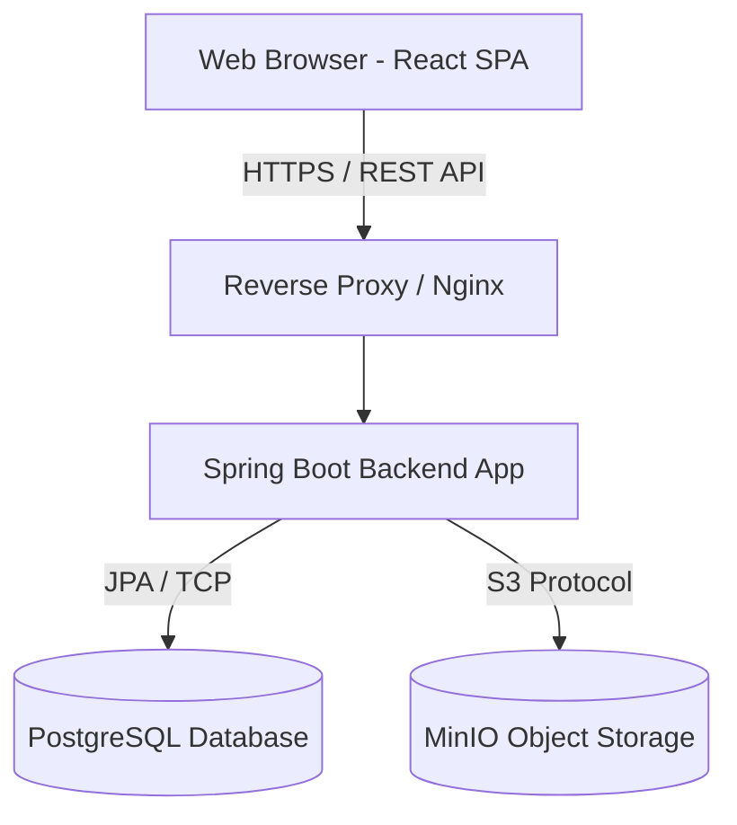

# Software Design Document (SDD)
## PrepareForTraining (KBase - Knowledge Base)

---

### 1. Introduction
Tài liệu này cung cấp cái nhìn tổng quan về kiến trúc phần mềm, các quyết định thiết kế kỹ thuật và cấu trúc hệ thống của PrepareForTraining (KBase). Tài liệu dành cho các lập trình viên (Developer), kỹ sư DevOps và các Kiến trúc sư giải pháp (Solution Architects).

### 2. System Architecture (Kiến trúc hệ thống)

Hệ thống tuân theo kiến trúc **Client-Server** với việc tách rời hoàn toàn giữa giao diện người dùng (Frontend) và xử lý nghiệp vụ (Backend).

#### 2.1. Kiến trúc vật lý (Deployment Architecture)

#### 2.2. Tech Stack (Công nghệ sử dụng)
- **Frontend**: React.js, TypeScript, Tailwind CSS, Vite.
- **Backend**: Java 17+, Spring Boot 3 (Web, Data JPA, Security).
- **Database**: PostgreSQL 15+.
- **File Storage**: MinIO (Tương thích 100% với AWS S3 API).
- **Documentation**: Springdoc OpenAPI (Swagger).

---

### 3. Logical Architecture (Kiến trúc logic Backend)

Backend tuân thủ mẫu thiết kế **Layered Architecture (MVC mở rộng)**:
1. **Controller Layer (`com.fpt...controller`)**: Chứa các REST API endpoint. Nhiệm vụ duy nhất là nhận HTTP Request, gọi Service và trả về HTTP Response chuẩn `ApiResponse<T>`.
2. **Service Layer (`com.fpt...service`)**: Chứa toàn bộ Business Logic, bao gồm phân quyền (Role validation), quy trình xử lý dữ liệu và giao tiếp với Storage.
3. **Repository Layer (`com.fpt...repository`)**: Kế thừa `JpaRepository`, thực hiện các câu truy vấn lên cơ sở dữ liệu PostgreSQL.
4. **DTO Layer (`com.fpt...dto`)**: Các class Data Transfer Object giúp ẩn đi các Entity nhạy cảm và xác thực dữ liệu đầu vào (Validation).

---

### 4. Component Design: Security & Authentication

#### 4.1. Luồng Xác thực (Authentication Flow)
- Hệ thống sử dụng **Stateless JWT (JSON Web Token)**.
- Khi người dùng đăng nhập bằng Email/Password, `AuthService` kiểm tra mật khẩu (đã băm BCrypt).
- Nếu hợp lệ, hệ thống gen ra JWT Token (chứa `email` và `role`).
- Các request sau này từ Frontend sẽ đính kèm header `Authorization: Bearer <Token>`.
- `JwtAuthenticationFilter` chặn request, giải mã token, xác minh tính hợp lệ và thiết lập `SecurityContext`.

#### 4.2. Luồng Phân quyền (Authorization Flow)
- **Role-based**: Áp dụng `@PreAuthorize("hasRole('ADMIN')")` ở tầng Controller để chặn truy cập trái phép.
- **Ownership-based**: Tại tầng Service, luôn lấy `email` từ token hiện tại để xác minh user đó có phải là thành viên của Project (thông qua bảng `project_members`) trước khi trả về dữ liệu.

---

### 5. Component Design: File Upload Storage

Quyết định thiết kế quan trọng: **Không lưu file vật lý vào Database hay ổ cứng server backend**.
- **Quy trình Upload**:
  1. Frontend gọi API `/api/v1/projects/{id}/documents` kèm multipart file.
  2. Spring Boot nhận file, `DocumentService` sinh ra một tên file duy nhất (UUID).
  3. Sử dụng AWS S3 SDK, Backend đẩy stream dữ liệu thẳng sang hệ thống **MinIO**.
  4. Backend nhận lại Object URL, sau đó lưu siêu dữ liệu (Tên gốc, Size, Content-Type, S3 URL) vào bảng `documents` trong PostgreSQL.
- **Lợi ích**: Postgres không bị phình to (bloat), dễ dàng backup, hệ thống có thể scale theo chiều ngang.

---

### 6. Database Design Overview
Vui lòng tham khảo chi tiết các trường dữ liệu tại file `DATABASE_DESIGN.md`. Core entities bao gồm:
- **User**: Định danh hệ thống.
- **Project**: Đơn vị quản lý cấp cao nhất.
- **ProjectMember**: Mối quan hệ N-N giữa User và Project.
- **Document**: Thông tin metadata của file.
